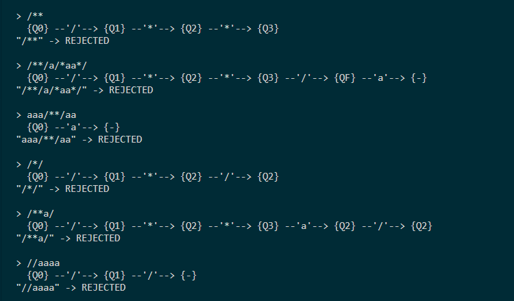
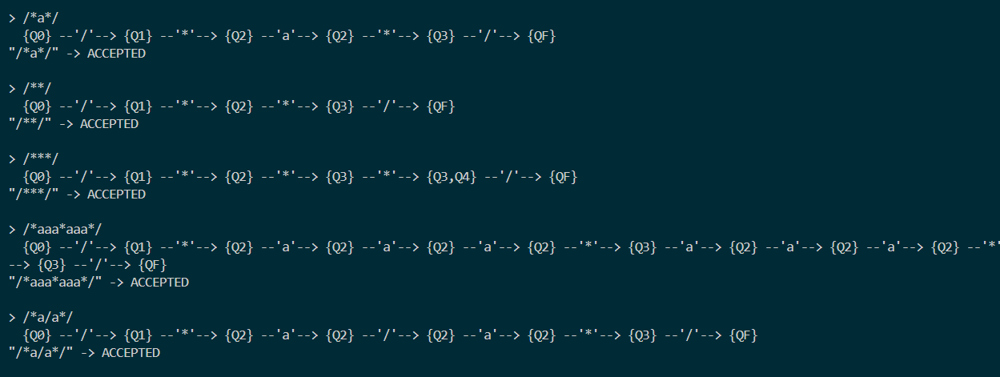
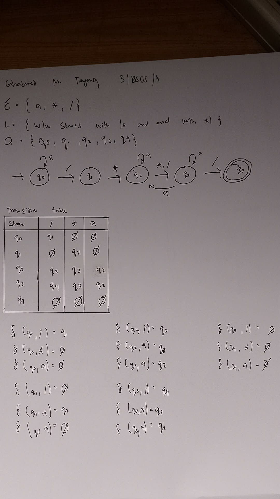
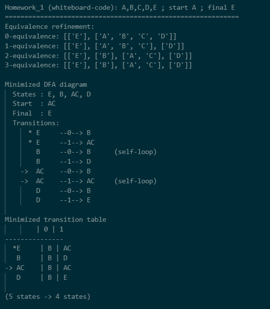
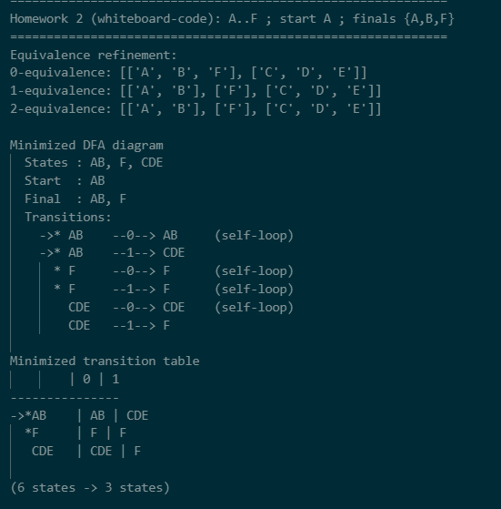
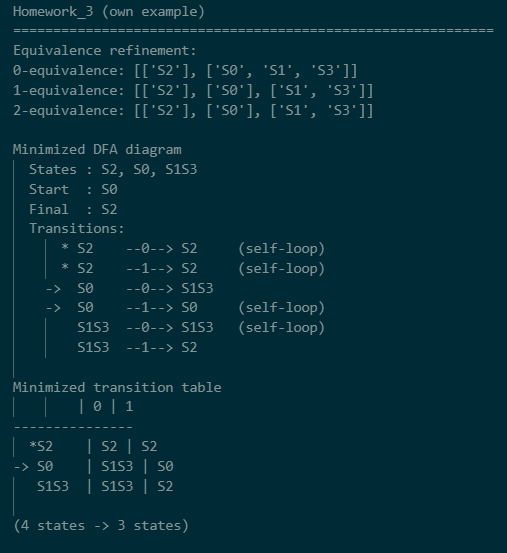
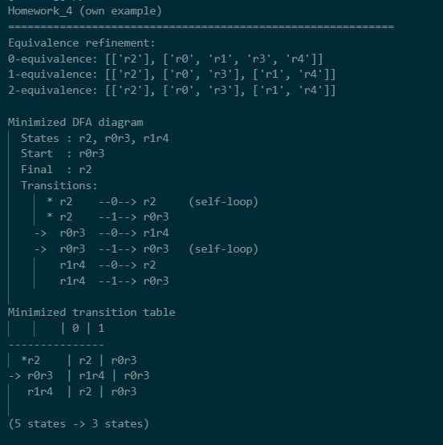

# CS13_C-Language_NFA-Assignment

# Program Output

## Rejected

## Accepted

## Diagram

## New Homework

## Homework 1 (code) from whiteboard

## Homework 2(code) from whiteboard

## Homework 3(own example) 

## Homework 4(own example) 

